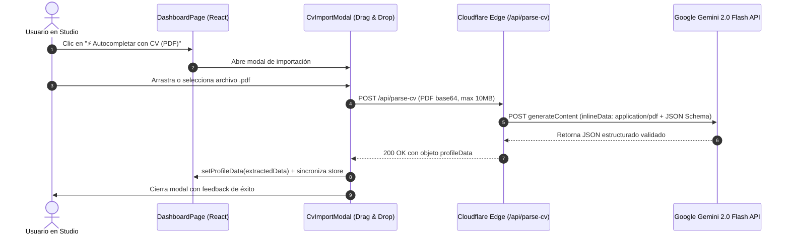

# 📄 Plan de Implementación: Autocompletar Portafolio con CV en PDF (Mi Vitae)

> **Objetivo:** Permitir que los profesionales suban su currículum en formato PDF y, mediante inteligencia artificial multimodal (Google Gemini Flash), se extraigan y estructuren todos sus datos laborales, académicos y de proyectos, rellenando automáticamente el editor de Mi Vitae STUDIO en segundos.

---

## 🎯 Decisiones Acordadas en el Diseño

| Aspecto | Decisión Acordada |
| :--- | :--- |
| **Ubicación en la App** | Botón destacado en el panel de control de **Mi Vitae STUDIO** (`DashboardPage.jsx`). |
| **Comportamiento con datos previos** | Reemplazo directo en el formulario sin modales de confirmación intermedios, para máxima fluidez y cero fricción. |
| **Tema visual** | Se respeta y mantiene el tema actual que el usuario tenga seleccionado. |
| **Privacidad del PDF** | Procesamiento 100% efímero en memoria: se extraen los datos y se descarta el archivo (sin almacenamiento persistente). |
| **Motor de IA** | **Google Gemini Flash** (API de Google AI Studio) con soporte multimodal nativo de PDF y esquema JSON estructurado. |
| **Infraestructura Backend** | Función Serverless en Cloudflare Pages: `functions/api/parse-cv.js` (enrutada también en `worker.js`). |

---

## 🏗️ Arquitectura Técnica



---

## 📋 Contrato de Datos: Esquema JSON de Extracción

El endpoint enviará a Gemini una directiva estricta para devolver exactamente la estructura que consume `profileStore`:

```json
{
  "personalInfo": {
    "name": "Nombre completo detectado",
    "title": "Titular o cargo profesional principal",
    "bio": "Resumen profesional redactado en 1 o 2 párrafos",
    "email": "correo@ejemplo.com",
    "phone": "+56 9 1234 5678",
    "location": "Ciudad, País"
  },
  "experiences": [
    {
      "company": "Nombre de la empresa",
      "role": "Cargo desempeñado",
      "period": "Ene 2021 - Presente",
      "description": "Descripción de responsabilidades",
      "achievements": ["Logro 1 con métricas", "Logro 2"]
    }
  ],
  "education": [
    {
      "institution": "Universidad o Instituto",
      "degree": "Título o Carrera",
      "period": "2016 - 2021",
      "description": "Detalles relevantes"
    }
  ],
  "skills": [
    { "name": "React", "category": "technical", "level": 85 },
    { "name": "Liderazgo", "category": "soft", "level": 90 }
  ],
  "projects": [
    {
      "title": "Nombre del proyecto",
      "description": "Breve descripción",
      "tags": ["Node.js", "PostgreSQL"],
      "liveUrl": "",
      "repoUrl": ""
    }
  ],
  "languages": [
    { "language": "Español", "level": "Nativo" },
    { "language": "Inglés", "level": "Avanzado C1" }
  ]
}
```

---

## 🛠️ Plan de Implementación Paso a Paso

### Paso 1: Backend Serverless — `functions/api/parse-cv.js`
1. Validar método `POST` y tamaño del payload (< 10MB).
2. Extraer el PDF en base64 de la petición.
3. Consultar la API de Gemini (`v1beta/models/gemini-2.0-flash:generateContent?key=${GEMINI_API_KEY}`).
4. Enviar el PDF mediante `inlineData` con mimeType `application/pdf`.
5. Forzar salida en `application/json` con el `responseSchema`.
6. Generar IDs únicos temporales (`exp-${timestamp}`, `edu-${timestamp}`) para compatibilidad con la reactividad de React.
7. Retornar los datos limpios.

### Paso 2: Router de Cloudflare Worker — `worker.js`
- Agregar la ruta `/api/parse-cv` para compatibilidad total con Wrangler y despliegues Edge.

### Paso 3: Componente UI — `CvImportModal.jsx`
1. Diseñar el modal con Tailwind CSS y Lucide Icons (`UploadCloud`, `FileText`, `Sparkles`, `CheckCircle2`, `AlertCircle`).
2. Zona de Drag & Drop con validación de tipo (`application/pdf`).
3. Barra o estados visuales animados durante la carga:
   - *1. Leyendo documento PDF...*
   - *2. Analizando trayectoria con IA...*
   - *3. Poblando tu portafolio...*
4. Manejo elegante de errores (PDF escaneado ilegible, archivo demasiado pesado, error de red).

### Paso 4: Integración en `DashboardPage.jsx`
1. Añadir botón en la cabecera del editor: *"⚡ Autocompletar con CV"*.
2. Al completarse la extracción:
   - Conservar el `username` del usuario activo, el `theme`, `avatar` existente y el estado del plan.
   - Sobrescribir `personalInfo`, `experiences`, `education`, `skills`, `projects` y `languages`.
   - Disparar el guardado automático para persistir los cambios de inmediato en Supabase Cloud.

### Paso 5: Pruebas y Verificación
- Prueba funcional con un archivo PDF real.
- Verificación con `npm test` y `npm run build`.

---

## 🔑 Instrucciones para Obtener la API Key de Google Gemini (Gratis)

1. Ingresa a [Google AI Studio](https://aistudio.google.com/).
2. Inicia sesión con tu cuenta de Google.
3. Haz clic en el botón azul **"Get API key"** (o "Crear clave de API").
4. Selecciona un proyecto de Google Cloud (o crea uno nuevo con 1 clic).
5. Copia la API Key generada (empieza por `AIzaSy...`).

### Dónde configurarla:
* **En desarrollo local:** En tu archivo `.env`:
  ```env
  GEMINI_API_KEY=AIzaSy...
  ```
* **En producción (Cloudflare Pages):**
  - Ve al Dashboard de Cloudflare > **Workers & Pages**.
  - Selecciona el proyecto **mi-vitae**.
  - Ve a **Settings** > **Variables and Secrets**.
  - Añade una nueva variable de entorno:
    - Nombre: `GEMINI_API_KEY`
    - Valor: `AIzaSy...` (cifrado como secret).
