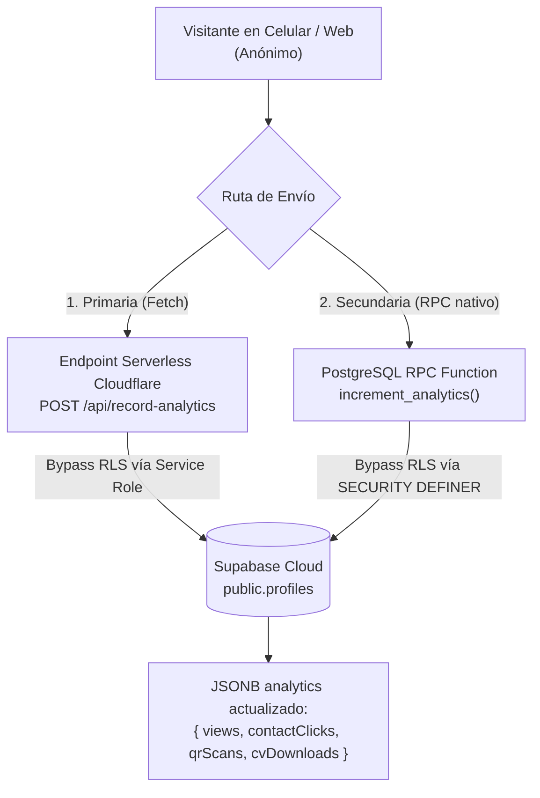

# Arquitectura y Funcionamiento Backend de las Métricas en Mi Vitae

Este documento detalla la arquitectura técnica, modelo de datos y flujo de ejecución en backend para cada una de las métricas de rendimiento y negocio de **Mi Vitae**.

---

## 1. Resumen de Métricas

| Métrica | Identificador en BD | Ubicación UI | Propósito |
| :--- | :--- | :--- | :--- |
| **Visitas Totales** | `views` | Vitae Studio | Mide cada apertura del portafolio interactivo `/:username`. |
| **Clics de Contacto** | `contactClicks` | Vitae Studio | Registra toques en el botón de contacto (WhatsApp, LinkedIn, Email, Teléfono). |
| **Escaneos QR** | `qrScans` / `cvDownloads` | Vitae Studio | Mide accesos originados al escanear el QR físico con un celular (`?ref=qr`). |
| **Tasa de Conversión (CR)** | Calculada en runtime | Vitae Studio | Proporción de visitantes que interactúan: `(contactClicks + qrScans) / views * 100`. |
| **MRR Proyectado** | Agregada en Admin | Panel Admin | Ingreso mensual recurrente basado en suscripciones activas ($3.490 CLP / $3.99 USD). |
| **ARR Proyectado** | Calculada en Admin | Panel Admin | Ingreso anualizado proyectado: `MRR * 12`. |
| **Comisiones de Afiliados** | `creator_code` | Panel Admin | Liquidación por usuario suscrito ($600 CLP Flow / $0.70 USD PayPal). |

---

## 2. Métricas de Rendimiento del Profesional (Vitae Studio)

### A. Visitas Totales (`views`)
* **Qué mide:** Cada vez que una persona (reclutador, cliente o visitante) carga el portafolio público (`https://mivitae.wearesamod.com/:username`).
* **Flujo de Captura:**
  1. En `src/pages/PortfolioPage.jsx`, al cargar los datos del perfil se ejecuta `recordView(username)`.
  2. `recordView` envía una petición a la API backend.
  3. En base de datos, el campo `analytics->>'views'` se incrementa atómicamente en `+1`.

### B. Clics de Contacto (`contactClicks`)
* **Qué mide:** Intención de contacto real. Se activa cuando el visitante pulsa el botón de acción flotante (Floating Action Button).
* **Canales soportados:**
  * WhatsApp (`https://wa.me/...`)
  * LinkedIn (`https://linkedin.com/in/...`)
  * Correo Electrónico (`mailto:...`)
  * Teléfono (`tel:...`)
* **Flujo de Captura:**
  1. El usuario hace clic en el botón flotante en `src/components/Themes/FloatingContactButton.jsx`.
  2. Se invoca `recordClick(username, 'contact')`.
  3. El backend actualiza `analytics->>'contactClicks'` sumando `+1`.

### C. Escaneos QR (`qrScans` / `cvDownloads`)
* **Qué mide:** Cuántas personas abrieron el portafolio tras escanear el código QR impreso en una tarjeta de presentación, currículum en papel o sticker.
* **Por qué en la Base de Datos figura como `cvDownloads`:**
  * En las primeras versiones de la plataforma existía un botón de "Descargar CV en PDF".
  * Al evolucionar Mi Vitae a un portafolio web interactivo donde la carta de presentación física es el Código QR generado en [`QrModal.jsx`](file:///D:/Proyectos/Paginas/Ficheros%20Fullstack/mi-vitae/src/components/Common/QrModal.jsx), el sistema reutilizó internamente ese contador para mantener compatibilidad con las columnas existentes en producción sin romper schemas previos.
  * Para máxima coherencia y legibilidad futura, el sistema ahora sincroniza **ambos campos a la par** (`qrScans` y `cvDownloads`).
* **Mecanismo de Atribución (Tracking Param):**
  * El generador de QR codifica la URL con el parámetro de campaña:  
    `https://mivitae.wearesamod.com/:username?ref=qr`
  * Cuando la cámara del teléfono abre ese enlace, `PortfolioPage.jsx` detecta `ref=qr` o `src=qr`.
  * Se utiliza una clave en `sessionStorage` (`mi_vitae_qr_recorded_<username>`) para deduplicar recargas involuntarias (F5) dentro de la misma pestaña.
  * Se invoca `recordClick(username, 'qr')`, incrementando el contador en el backend.

### D. Tasa de Conversión (Conversion Rate)
* No se guarda como un número fijo en la base de datos, sino que se calcula dinámicamente en tiempo de ejecución:
  $$\text{CR} = \begin{cases} \left(\frac{\text{contactClicks} + \text{qrScans}}{\text{views}}\right) \times 100 & \text{si } \text{views} > 0 \\ 0.0\% & \text{si } \text{views} = 0 \end{cases}$$
* Esto evita discrepancias históricas y garantiza que si las visitas o clics aumentan, el porcentaje siempre refleje el estado real.

---

## 3. El Problema del RLS y la Solución en Backend

### ¿Por qué los visitantes anónimos no podían actualizar las métricas?
En Supabase (PostgreSQL), la tabla `public.profiles` tiene habilitada la seguridad por filas (**Row Level Security - RLS**):
```sql
-- Política RLS por defecto:
CREATE POLICY "Users can update their own profile" 
ON public.profiles 
FOR UPDATE 
TO authenticated 
USING (auth.uid() = id);
```
Cuando un reclutador o un teléfono escanea un código QR:
* El visitante **no está logueado** (`auth.uid() IS NULL`).
* Cualquier consulta directa tipo `supabase.from('profiles').update(...)` es **bloqueada silenciosamente por PostgreSQL**, retornando 0 filas modificadas.

### Arquitectura de Solución de Doble Capa

Para resolver esto sin debilitar la seguridad de la tabla de perfiles, implementamos dos mecanismos complementarios:



#### Capa 1: Endpoint Serverless (`functions/api/record-analytics.js`)
* **Ruta:** `POST /api/record-analytics`
* **Entorno:** Cloudflare Workers / Pages Functions.
* **Comportamiento:**
  1. Valida el `username` y la métrica enviada (`views`, `contactClicks`, `cvDownloads`, `qrScans`).
  2. Si está configurada la variable de entorno `SUPABASE_SERVICE_ROLE_KEY`, ejecuta un `PATCH` autenticado directamente a la API REST de Supabase.
  3. La clave de servicio (`service_role`) se ejecuta exclusivamente en el servidor (nunca se expone al cliente) y tiene privilegios de superusuario para omitir las políticas de RLS.
  4. Retorna el nuevo objeto de analíticas al navegador.

#### Capa 2: Procedimiento Almacenado Nativo (`public.increment_analytics`)
* **Definición SQL:**
```sql
CREATE OR REPLACE FUNCTION public.increment_analytics(
  target_username TEXT,
  metric_name TEXT
)
RETURNS JSONB AS $$
DECLARE
  result JSONB;
  clean_username TEXT := LOWER(TRIM(target_username));
  clean_metric TEXT := LOWER(TRIM(metric_name));
  new_qr INT;
BEGIN
  -- Inicialización segura si analytics es nulo
  UPDATE public.profiles
  SET analytics = '{"views":0,"contactClicks":0,"cvDownloads":0,"qrScans":0}'::jsonb
  WHERE LOWER(username) = clean_username AND analytics IS NULL;

  IF clean_metric = 'views' THEN
    UPDATE public.profiles
    SET 
      analytics = jsonb_set(
        COALESCE(analytics, '{}'::jsonb), 
        '{views}', 
        to_jsonb(COALESCE((analytics->>'views')::int, 0) + 1)
      ),
      updated_at = NOW()
    WHERE LOWER(username) = clean_username
    RETURNING analytics INTO result;

  ELSIF clean_metric = 'contactclicks' OR metric_name = 'contactClicks' THEN
    UPDATE public.profiles
    SET 
      analytics = jsonb_set(
        COALESCE(analytics, '{}'::jsonb), 
        '{contactClicks}', 
        to_jsonb(COALESCE((analytics->>'contactClicks')::int, 0) + 1)
      ),
      updated_at = NOW()
    WHERE LOWER(username) = clean_username
    RETURNING analytics INTO result;

  ELSIF clean_metric = 'cvdownloads' OR clean_metric = 'qr' OR clean_metric = 'qrscans' OR metric_name = 'cvDownloads' THEN
    SELECT GREATEST(COALESCE((analytics->>'cvDownloads')::int, 0), COALESCE((analytics->>'qrScans')::int, 0)) + 1
    INTO new_qr
    FROM public.profiles
    WHERE LOWER(username) = clean_username;

    UPDATE public.profiles
    SET 
      analytics = jsonb_set(
        jsonb_set(
          COALESCE(analytics, '{}'::jsonb), 
          '{cvDownloads}', 
          to_jsonb(COALESCE(new_qr, 1))
        ),
        '{qrScans}',
        to_jsonb(COALESCE(new_qr, 1))
      ),
      updated_at = NOW()
    WHERE LOWER(username) = clean_username
    RETURNING analytics INTO result;
  END IF;

  RETURN result;
END;
$$ LANGUAGE plpgsql SECURITY DEFINER;

-- Permisos de ejecución pública
GRANT EXECUTE ON FUNCTION public.increment_analytics(TEXT, TEXT) TO anon, authenticated, service_role;
```

* **Por qué funciona:**  
  La cláusula `SECURITY DEFINER` le indica a PostgreSQL que la función se ejecuta con los privilegios del creador de la función (`postgres`), ignorando las restricciones RLS para el anónimo pero limitando estrictamente la mutación a las columnas y claves numéricas de analíticas.

---

## 4. Métricas de Negocio y Financiación (Panel Admin)

En el panel de administración (`src/pages/AdminPage.jsx`), las métricas financieras se calculan a partir de la tabla `public.transactions` y los perfiles con estado activo:

### A. MRR Proyectado (Monthly Recurring Revenue)
* **Regla de cálculo:**
  * Cada usuario con `plan === 'premium'` o `plan_status === 'active'` proyecta un valor mensual recurrente.
  * Para suscriptores en Chile (Flow.cl): **$3.490 CLP/mes**.
  * Para suscriptores internacionales (PayPal): **$3.99 USD/mes**.
* **Fórmula de agregación:**
  $$\text{MRR}_{\text{CLP}} = \sum (\text{Usuarios Activos Chile} \times 3.490)$$
  $$\text{MRR}_{\text{USD}} = \sum (\text{Usuarios Activos PayPal} \times 3.99)$$

### B. ARR Proyectado (Annual Recurring Revenue)
* Proyección a 12 meses del ingreso recurrente actual:
  $$\text{ARR} = \text{MRR} \times 12$$

### C. Comisiones de Creadores y Afiliados (`creator_code`)
* Cuando un usuario se suscribe usando el código de un creador (ej: `DEVCHILE`):
  1. El código se sanitiza y se almacena en la transacción (`transactions.creator_code`).
  2. En el panel de administración se calcula la comisión por usuario activo asignado:
     * **Chile (Flow.cl):** **$600 CLP** por usuario mensual.
     * **Internacional (PayPal):** **$0.70 USD** por usuario mensual.
  3. Esto permite liquidar a cada influencer o afiliado el total exacto mensual según sus usuarios activos.

---

## 5. Verificación y Monitoreo

Para comprobar en cualquier momento el estado de las métricas en la base de datos de producción:

```javascript
// Consulta directa con Supabase JS
const { data, error } = await supabase
  .from('profiles')
  .select('username, analytics')
  .eq('username', 'juan--erices-f')
  .single();

console.log(data.analytics);
// Salida esperada:
// { views: 107, contactClicks: 6, cvDownloads: 1, qrScans: 1 }
```

Todas las pruebas unitarias y de integración que certifican este comportamiento se encuentran en [`tests/functional.test.mjs`](file:///D:/Proyectos/Paginas/Ficheros%20Fullstack/mi-vitae/tests/functional.test.mjs) (Suite 12).
